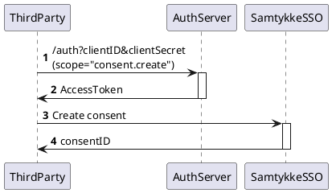

# Fetching debt information with consents

This service lets you:

* Ask user for consent to share unsecured debt information
* Fetch information about a Norwegian citizens unsecured debt based on that consent

It uses a redirect-based flow which adheres to the common OAuth2.0 and OpenID Connect standards.

The debt info is delivered on the same format as our debt query API, but since it is provided with
the end users consent, we also include the name of the creditors.

## 1 - Getting started

### 1.1 - Introduction


### 1.2 - Requirements

Before you can start using this service you have to enter into an agreement with Norsk
Gjeldsinfomasjon, this is handled by emailing us
at [support@norskgjeld.no](mailto:support@norskgjeld.no).

When you have signed an agreement, we will send your client id and client secret. You must provide
us with the URLs where you want to receive the callback after the consent flow finishes. This is not required if you
only intend to manage consents externally ([see section 2.6](#26-consents-created-and-managed-outside-nogi-eg-in-an-online-bank))

This service does not require 2-way TLS, so client certificates (Virksomhetssertifikat, SEID) are 
**not** required.

If you plan to run from a provider where you share multiple outbound IP-addresses (eg. cloud
providers), you should purchase fixed outbound IP-address(es).

### 1.3 - Testing

Before you can start testing you will need a client with registered callback URIs and a BankID test
user.

This can be created
at [https://ra-preprod.bankidnorge.no/#/generate](https://ra-preprod.bankidnorge.no/#/generate).
Generate an SSN and set the BankID type to netcentric. When you use this BankID with ID-porten for
the first time, you will be asked if you want to add additional info which you can skip.

In preprod (BankID TestBank) the one-time code is always `otp`, and the password is `qwer1234`

Note: There will not be any loan information stored on the BankID test person you have created in
our test environment, so the debt API will not list any creditors.

Mocked debt data is available on several synthetic personal numbers: `14842249091` and `29868099311`

## 2 - Core concepts

### 2.1 - OAuth 2.0

OAuth 2.0 is the industry-standard protocol for authorization. Giving an introduction to it is out
of scope of this documentation, but there are a lot of good sources out there. We recommend looking
at the [documentation](https://oauth.net/2/), and especially the list of community resources.

### 2.2 - Access token

Access tokens are opaque strings that represents the authorization of a specific application to
access specific parts of a user’s data. There is no information encoded in the token itself, but it
can be used to collect debt information from
the [debt API](Open API/#debt-api).
**Access tokens are sensitive.** It is important that they are stored securely.

### 2.3 - Flows

We are using two OAuth2.0 flows, Authorization Code and Client Credentials.

#### 2.3.1 Authorization Code Flow

[Authorization Code flow](https://oauth.net/2/grant-types/authorization-code/) is used to
authenticate a user and obtain a consent to share their debt information. It is initiated by
redirecting the users browser to our /auth endpoint with the required parameters in the URL.

#### 2.3.2 Client Credentials Flow

The [Client Credentials flow](https://oauth.net/2/grant-types/client-credentials/) is used to obtain
an access token to identify the client when collecting debt information with a consent which was
granted for an extended duration.

The access token received on this request is used in addition to the id of the consent when querying
the debt API.

### 2.4 - Scopes

Scopes are space-separated lists of identifiers used to specify what access privileges are being
requested.

Due to legal reasons a consent is required to have a specific purpose; you can therefore only ask
the user to consent to one scope at a time.

The scopes also contain the purpose of the consent, which can either be presentation of debt
information (gjeldsinformasjonen) - or credit processing.

This is done by supplying the corresponding scope when you initiate the flow, and the request to
/auth must therefore contain one and only one of the following scopes:

<table data-table-width="760" data-layout="default" data-local-id="665a77b0-ea6f-4be9-8a55-ab597da672c2" class="confluenceTable"><colgroup><col style="width: 230.0px;"><col style="width: 264.0px;"><col style="width: 142.0px;"><col style="width: 120.0px;"></colgroup><tbody><tr><td class="confluenceTd"><p><strong>Scope</strong></p></td><td class="confluenceTd"><p><strong>Intended use</strong></p></td><td class="confluenceTd"><p><strong>Default duration</strong></p></td><td class="confluenceTd"><p><strong>Max duration</strong></p></td></tr><tr><td class="confluenceTd"><p>debt.unsecured.presentation</p></td><td class="confluenceTd"><p>Solely for displaying the debt info</p></td><td class="confluenceTd"><p>10 min</p></td><td class="confluenceTd"><p>365 days</p></td></tr><tr><td class="confluenceTd"><p>debt.unsecured.processing</p></td><td class="confluenceTd"><p>Credit processing, for example refinancing of existing debt</p></td><td class="confluenceTd"><p>10 min</p></td><td class="confluenceTd"><p>28 days</p></td></tr></tbody></table>

A default consent allows you to collect the debt info one time within 10 minutes.

See section 2.5 for consents with an extended duration

**OPTIONAL:**

It is also possible to ask for the openid scope. This is used to contain the ssn and consentID of
the flow.

If you request the openid scope, it must be the last scope given in the request.  
Correct: “debt.unsecured.presentation openid”.  
Incorrect: “openid debt.unsecured.presentation”

<table data-table-width="760" data-layout="default" data-local-id="48c8c426-5c7b-462a-9158-88489d33270d" class="confluenceTable"><colgroup><col style="width: 94.0px;"><col style="width: 421.0px;"><col style="width: 245.0px;"></colgroup><tbody><tr><td class="confluenceTd"><p><strong>Scope</strong></p></td><td class="confluenceTd"><p><strong>Intended use</strong></p></td><td class="confluenceTd"><p><strong>Description</strong></p></td></tr><tr><td class="confluenceTd"><p>openid</p></td><td class="confluenceTd"><p>Receive consentID and ssn securely for verifying correct person has consented to share debt information.</p><p>Can be used to go directly to the Client Credentials Flow from the Authorization Code Flow by extracting the consentID from the ID Token.</p></td><td class="confluenceTd"><p>ID Token as a JWT-token with:<br>”pid”: &lt;ssn&gt;<br>and<br>”consent_id”: &lt;consentID&gt;</p><p>Note: The “sub” field should not be stored</p></td></tr></tbody></table>

### 2.5 - Consents with an extended duration

It is possible to ask the user for a consent with an extended duration. This is done by appending
the requested duration of the consent **in days** after the scope.

Starting the flow with the scope “debt.unsecured.presentation.365” would prompt the user to consent
to sharing their debt information for 365 days, which is the maximum duration for this type of
consent. Note that this is a way to specify duration. The scope name displayed in redirect URLs will
still be “debt.unsecured.presentation”.

The two scopes have different max numbers of days that you can request, and if provided a number
higher than this we will default to the boundary value.

It is possible to choose a shorter duration than the maximum duration if that is more suitable for
you, for example debt.unsecured.presentation.50 would prompt the user to consent to sharing their
debt information for 50 days.

The debt info can be collected any number of times using consents with an extended duration, but
keep in mind that users can log into [www.norskgjeld.no](http://www.norskgjeld.no) and see every
single time their consent has been used to collect debt info.

### 2.6 - Consents created and managed outside NoGi (e.g. in an online bank)
**THIS IS A NEW FEATURE, AND THE APIS AND DOCUMENTATION WILL CHANGE!**




Consents can also be captured and managed in your own system, and only "registered" in NoGi.
In order to be able to use this feature, you must conform to the rules and regulations
for this functionality, and sign an agreement up-front.

After you have gathered the consent from the enduser, you will register the consent (and its scope)
at NoGi. Before you can register the new consent, you must first fetch new access token using 
[3.4.3 - Client Credentials Flow](#343-client-credentials-flow) with scope set to `consent.create`.

The access token is then used to call the [PUT - /v1/consent/agreement endpoint](Open API.md#put-v1consentagreement) 
to register the consent from the enduser at NOGI. The `scope_of_consent`, described in API documentation for 
[PUT - /v1/consent/agreement endpoint](Open API.md#put-v1consentagreement), is the same type of Scope described in 
[2.4 - Scopes](#24-scopes). This will return the NOGI generated consentId (`consent.id` in response).

You can then fetch debt by getting an access token using client credentials flow (see 
[3.4.3 - Client Credentials Flow](#343-client-credentials-flow)), and then fetch debt as described in 
[4 - Collect Debt Info API](#4-collect-debt-info-api)

#### Example implementation
There is an example implementation in python of how to create and fetch debt using contract based 
consents here: [create-agreementbased.py](./assets/create-agreementbased.py). Remember to replace the values of the variables in 
the script:
```python
client_id = '<your-client-id>'
client_secret = '<your-client-secret>'
```
with your own client information.

## 3 - Integration

The Consent API is compliant with the OAuth2.0 standard. We therefore strongly recommend that you
use a client library to perform this part of the integration.

A good place to start is to
search [the list of clients certified by the OpenID foundation](https://openid.net/developers/certified/)
for a client written in your programming language.

### 3.1 - Base Urls

<table data-table-width="760" data-layout="default" data-local-id="158cd79e-8d3d-488f-81a6-e4fee63898be" class="confluenceTable"><colgroup><col style="width: 473.0px;"><col style="width: 287.0px;"></colgroup><tbody><tr><td class="confluenceTd"><p><strong>Environment</strong></p></td><td class="confluenceTd"><p><strong>Base URL</strong></p></td></tr><tr><td class="confluenceTd"><p>Preprod</p></td><td class="confluenceTd"><p>https://access-preprod.norskgjeld.no</p></td></tr><tr><td class="confluenceTd"><p>Prod</p></td><td class="confluenceTd"><p>https://access.norskgjeld.no</p></td></tr></tbody></table>

### 3.2 - /.well-known/openid-configuration

The OpenID-configuration returns metadata which can be used to configure your client library.

_**Example request**_

```
GET:https://access-preprod.norskgjeld.no/.well-known/openid-configuration
```

_**Example**_ _**response**_

```json
{
    "issuer":"https://access-preprod.norskgjeld.no/",
    "authorization_endpoint":"https://access-preprod.norskgjeld.no/oauth2/auth",
    "token_endpoint":"https://access-preprod.norskgjeld.no/oauth2/token",
    "jwks_uri":"https://access-preprod.norskgjeld.no/.well-known/jwks.json",
    "subject_types_supported":[
      "pairwise"
    ],
    "response_types_supported":[
      "code"
    ],
    "claims_supported":[
      "sub"
    ],
    "grant_types_supported":[
      "authorization_code",
      "client_credentials"
    ],
    "response_modes_supported":[
      "query",
      "fragment"
    ],
    "userinfo_endpoint":"https://access-preprod.norskgjeld.no/userinfo",
    "scopes_supported":[
      "openid"
    ],
    "token_endpoint_auth_methods_supported":[
      "client_secret_basic"
    ],
    "userinfo_signing_alg_values_supported":[
      "none",
      "RS256"
    ],
    "id_token_signing_alg_values_supported":[
      "RS256"
    ],
    "request_parameter_supported":true,
    "request_uri_parameter_supported":true,
    "require_request_uri_registration":true,
    "claims_parameter_supported":false,
    "revocation_endpoint":"https://access-preprod.norskgjeld.no/oauth2/revoke",
    "end_session_endpoint":"https://access-preprod.norskgjeld.no/oauth2/sessions/logout",
    "request_object_signing_alg_values_supported":[
      "RS256",
      "none"
    ]
}
```

### 3.3 - /oauth2/auth

The auth endpoint is the starting point for the OAuth2.0 Authorization code flow. This request
authenticates the user and returns a code on the callback which can be exchanged for an access token
towards the /token endpoint.

It is important that you show the user some kind of confirmation that the consent has been received
on the callback. This could for example be a landing page if you intend to redirect the user to
another service.

<table data-table-width="760" data-layout="default" data-local-id="8639edb0-900e-49c7-99ab-70b78fca03b8" class="confluenceTable"><colgroup><col style="width: 135.0px;"><col style="width: 485.0px;"><col style="width: 140.0px;"></colgroup><tbody><tr><td class="confluenceTd"><p><strong>Parameter</strong></p></td><td class="confluenceTd"><p><strong>Description</strong></p></td><td class="confluenceTd"><p><strong>Required</strong></p></td></tr><tr><td class="confluenceTd"><p>client_id</p></td><td class="confluenceTd"><p>client id received from Norsk Gjeldsinformasjon</p></td><td class="confluenceTd"><p>yes</p></td></tr><tr><td class="confluenceTd"><p>response_type</p></td><td class="confluenceTd"><p>Must be set to "code"</p></td><td class="confluenceTd"><p>yes</p></td></tr><tr><td class="confluenceTd"><p>scope</p></td><td class="confluenceTd"><p>Must contain one and only one debt-related scope. It may optionally contain the “openid” scope</p></td><td class="confluenceTd"><p>yes</p></td></tr><tr><td class="confluenceTd"><p>redirect_uri</p></td><td class="confluenceTd"><p>Whitelisted URI where the user will be redirected after consenting</p></td><td class="confluenceTd"><p>yes</p></td></tr><tr><td class="confluenceTd"><p>state</p></td><td class="confluenceTd"><p>This is mirrored back in the callback request. Should be set to a random value for each request</p></td><td class="confluenceTd"><p>yes</p></td></tr></tbody></table>

_**Example request:**_

```
GET:https://access-preprod.norskgjeld.no/oauth2/auth?client_id=your_client_id_here&response_type=code&scope=debt.unsecured.presentation&state=thisShouldBeARandomValue&redirect_uri=https://api-eksempelbank.no/v1/callback
```

_**Example response:**_

```
Success response:
https://api-eksempelbank.no/v1/callback?code=wi-w8zIdwwBHggkHhSjR24wH8pN6MDqxdObTBDuzaZo.sciTzz9qgwMlGBZ6X0jYIDyib8MupoIp5gbIJBxnTCs&scope=debt.unsecured.presentation&state=thisShouldBeARandomValue

Error response:
https://api-eksempelbank.no/v1/callback?error=consent_denied&error_description=&state=thisShouldBeARandomValue
```

The error code can be "consent\_denied", "server\_error", "invalid\_scopes" or "login\_cancelled"

### 3.4 - /token

The token endpoint is used to obtain an access token which is used when collecting debt information
from the debt-API. This can either be completed with the code received on the callback after the
user has finished delivering their consent (Authorization Code Flow) , or the client can identify
directly with their credentials to obtain an access token directly (Client Credentials Flow).

[Here](Postman) is a [Postman](https://www.postman.com/) collection that contain examples for these
flows.

#### 3.4.1 - Authentication

When calling the token endpoint you have to identify yourself. This is done by supplying your client
id and client secret in the Authorization header using
the [Basic authentication scheme](https://developer.mozilla.org/en-US/docs/Web/HTTP/Authentication#basic_authentication_scheme).

#### 3.4.2 - Authorization Code Flow

When requesting an access token using authorization code flow the following parameters have to be
present in the body which should be of type application/x-www-form-urlencoded

<table data-table-width="760" data-layout="default" data-local-id="eb2fd1e6-f278-4d26-8cab-70532b025f51" class="confluenceTable"><colgroup><col style="width: 340.0px;"><col style="width: 340.0px;"></colgroup><tbody><tr><td class="confluenceTd"><p><strong>Parameter</strong></p></td><td class="confluenceTd"><p><strong>Description</strong></p></td></tr><tr><td class="confluenceTd"><p>grant_type</p></td><td class="confluenceTd"><p>Must be set to “authorization_code”</p></td></tr><tr><td class="confluenceTd"><p>client_id</p></td><td class="confluenceTd"><p>Client id received from Norsk Gjeldsinformasjon</p></td></tr><tr><td class="confluenceTd"><p>redirect_uri</p></td><td class="confluenceTd"><p>Whitelisted URI where the user will be redirected after consenting</p></td></tr><tr><td class="confluenceTd"><p>code</p></td><td class="confluenceTd"><p>Authorization received on the authorization callback</p></td></tr></tbody></table>

_**Example request**_

```
POST:https://access-preprod.norskgjeld.no/oauth2/token
```

HEADERS and BODY as described above.

There is an example in the Postman collection ‘Tokens/Exchange Auth Code for Tokens’

_**Example response**_

```json
{
    "access_token":"YcvXKoiuOwnbJkxso2Oe6bhp2cXcoHdZ1pdgE_QpDww.cAu8_J51evXtBQxfTMzkRA414_mOla1zryE1e_-r-1k",
    "expires_in":3599,
    "scope":"debt.unsecured.presentation",
    "token_type":"bearer"
}
```

#### 3.4.3 - Client Credentials Flow

When requesting an access token using the client credential flow the following parameters have to be
present in the body which should be of type application/x-www-form-urlencoded

<table data-table-width="760" data-layout="default" data-local-id="e3b0d4ad-923a-4206-bfe9-597394e5d2a3" class="confluenceTable"><colgroup><col style="width: 340.0px;"><col style="width: 340.0px;"></colgroup><tbody><tr><td class="confluenceTd"><p><strong>Parameter</strong></p></td><td class="confluenceTd"><p><strong>Description</strong></p></td></tr><tr><td class="confluenceTd"><p>grant_type</p></td><td class="confluenceTd"><p>Must be set to “client_credentials”</p></td></tr><tr><td class="confluenceTd"><p>audience</p></td><td class="confluenceTd"><p>Must be set to "<a class="external-link" href="https://api.norskgjeld.no/v1/debt" rel="nofollow">https://api.norskgjeld.no/v1/debt</a>” in prod and “<a href="#" rel="nofollow">https://api-preprod.norskgjeld.no/v1/debt”</a> in preprod</p></td></tr><tr><td class="confluenceTd"><p>scope</p></td><td class="confluenceTd"><p>Must contain a space separated string with the scopes that you are going to fetch debt information for. It should usually be set to:&nbsp;</p><div class="code panel pdl" style="border-width: 1px;"><div class="codeContent panelContent pdl"><pre class="syntaxhighlighter-pre" data-syntaxhighlighter-params="brush: java; gutter: false; theme: Confluence" data-theme="Confluence">debt.unsecured.presentation debt.unsecured.processing</pre></div></div></td></tr></tbody></table>

_**Example request**_

```
POST:https://access-preprod.norskgjeld.no/oauth2/token
```

HEADERS and BODY as described above.

There is an example in the Postman collection ‘Tokens/Get Client Credential Token’

_**Example response**_

```json
{
    "access_token":"C2EzneyuE2lEK8VBYZS7TxBUMF16Ns6gTuU5DybZbY.6pcF_rv3muje47_GDucYJrQZvDioc8O7oCmvKMZKHEg",
    "expires_in":3599,
    "scope":"debt.unsecured.presentation debt.unsecured.processing",
    "token_type":"bearer"
}
```

## 4 - Collect Debt Info API

After you have received an access token from the Authorization server you can use it to collect the
debt information from the API which is
documented [here](Open API/#debt-api).
