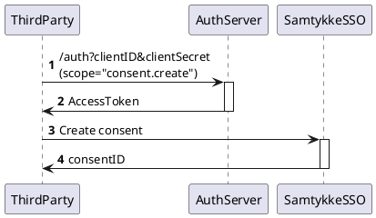

---
tags:
  - consent
---

# Manage consents externally (e.g. in an online bank)

If you capture and manage consents in your own system, you can register them in
Norsk Gjeldsinformasjon instead of using the redirect-based consent flow (see [regular consent](../get-started/index.md#regular-consent)).

In order to use this feature, you must conform to the rules and regulations for this
functionality, and sign an agreement up-front.

## Prerequisites

- You have entered into an agreement with Norsk Gjeldsinformasjon for external consent
  management
- You have a client id and client secret
- You have gathered consent from the end user in your own system

## 1. Fetch an access token with the consent.create scope

Before you can register a consent, you need an access token with the `consent.create` scope
using the [Client Credentials flow](../reference/index.md#client-credentials-flow).



## 2. Register the consent

Call the [PUT /v1/consent/agreement](../reference/openapi.md) endpoint (under the **Agreement API** tag) with the access token. The `scope_of_consent` parameter uses the same [scopes](../reference/index.md#consent-purpose)
as the regular consent flow.

The response contains the NoGi-generated `consent.id`.

## 3. Fetch debt using the registered consent

Once registered, you can fetch debt information using the [Client Credentials flow](../reference/index.md#client-credentials-flow)
to get an access token, and then call the [debt lookup API](../reference/openapi.md) (under the **Debt Api** tag).

## Example implementation

An example implementation in Python is available
here: [create-agreementbased.py](../reference/assets/create-agreementbased.py).
Remember to replace the variables in the script with your own client information:

```python
client_id = '<your-client-id>'
client_secret = '<your-client-secret>'
```