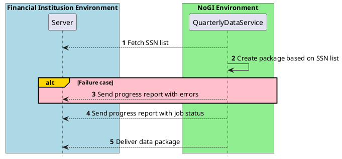

# Get sent quarterly debt reports regarding own customers

Norsk Gjeldsinformasjon offers a service for sending financial institutions packaged data of their customer base. 

The service provides the packaged data to be sent directly to the financial institution over SFTP.

See specifics terms for use in the [domain docs](https://norskgjeld.atlassian.net/wiki/x/AYBXHQ)

## Setup for SFTP server
To be able to connect to your server and send the packaged data over SFTP we require you to follow the steps below.

### Onboarding
#### 1. Exchange necessary connection details
Send the following connection details over email to support@norskgjeld.no

* IP-address
From which the test connection call will be made
* Complete SFTP URL
Including specific folder we shall fetch SSN list and put packaged data file
* Authentication Config
Alternatively - Username and Password - OR - *Recommended: PKC Key for NoGI account*

#### 2. NoGI will onboard your configuration
Once the information is submitted to NoGI, our support team will onboard your configuration.
NoGI will then verify that our systems can establish contact with your server.

#### 3. Preparing an SSN-list
Once the connection is established the SSN list can be prepared based on following rules
and can be kept there at the predefined location as per SFTP url given to NoGI

* File name should be with organization name and file extension should be ".txt", for example "985815534.txt"
* If an organization needs data package on behalf of separate organizations, then different files with all the organization number should be kept there. 
 Make sure NoGI has received all the organization numbers which banks wants the data package on behalf of.
* SSN list should be a text file with CSV format (comma-separated value) with all valid SSNs.

### Execution  
Workflow refers to steps shown in [High-level workflow]
The steps below will be executed the first date in each yearly quarter//TODO HER SLAPP JEG

* Once the service is triggered once in a quarter, NoGI will get the SSN list file from your server and will process it.
* If the SSN list file has some errors, bank will receive a Failure report with same file name for e.g 920013015-468886022-3-2020-failure-report.txt
  * Errors can for instance be SSN list not found/wrong name file found/expected organization number not found etc.
* If the SSN list file received is valid, packaging service will begin creating a package which is gzip file.
* A progress report will be delivered while our service works.
  * Progress report name format is also same as failure report: 920013015-468886022-3-2020-Progress-report.txt
  * Progress report consist of list of invalid SSNs, Duplicate SSNs for which the package will be created.
* When the data package file has been generated it will be deliverd to the specified location over SFTP as a .gzip file.

## High-level workflow

## FAQ

### Why are some SSN number's loan array empty?
If Norsk Gjeldsinformasjon does not find the SSN in indexregister registered by any bank which was present in your SSN, the  list then will have empty data.

### When can we delete the SSN list?
Note that Norsk Gjeldsinformasjon will typically download the SSN list multiple times. We will normally download it two times: once for validating the data and then for processing the file. We might download even more time in cases where our batch process fails.

The reason for this is that we do not maintain a copy or cache the file on our side.

When the job is complete and the data package are present on your SFTP server, it is safe to remove the SSN list.