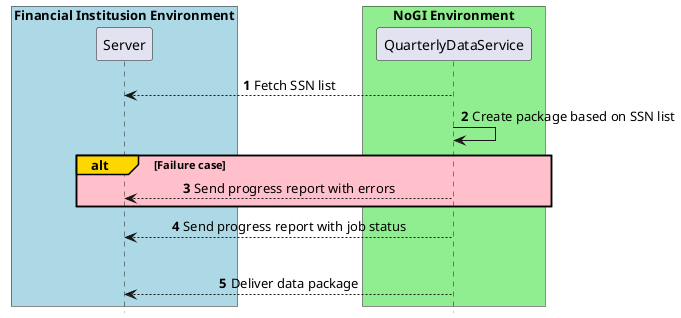

# Get sent quarterly debt reports regarding own customers

Norsk Gjeldsinformasjon offers a service for sending financial institutions packaged data of their
customer base once every fiscal quarter.

The service provides the packaged data to be sent directly to the financial institution over SFTP.

See specifics terms for use in the [domain docs](https://norskgjeld.atlassian.net/wiki/x/AYBXHQ)

## Setup for SFTP server

To be able to connect to your server and send the packaged data over SFTP we require you to follow
the steps below.

### Prerequisites

* Contact support@norskgjeld.no regarding wanting to use this service.
* Having a server setup we could connect to using SFTP.

### Onboarding

#### 1. Exchange necessary connection details

Send the following connection details over email to support@norskgjeld.no

* IP-address
  From which the test connection call will be made
* Complete SFTP URL
  Including specific folder we shall fetch SSN list and put packaged data file
* Authentication Config
  Alternatively - Username and Password - OR - *Recommended: PKC Key for NoGI account*

#### 2. NoGI will onboard your configuration

Once the information is submitted to NoGI, our support team will onboard your configuration.
NoGI will then verify that our systems can establish contact with your server.

#### 3. Preparing an SSN-list

Once the connection is established the SSN list can be prepared based on following rules
and can be kept there at the predefined location as per SFTP url given to NoGI

* File name should be with organization name and file extension should be ".txt", for example "
  985815534.txt"
* If an organization needs data package on behalf of separate organizations, then different files
  with all the organization number should be kept there.
   Make sure NoGI has received all the organization numbers which banks wants the data package
  on behalf of.
* SSN list should be a text file with CSV format (comma-separated value) with all valid SSNs.

### Execution

Workflow refers to steps shown in [High-level workflow](#high-level-workflow)
The steps below will be executed the first date in each yearly quarter

* Once the service is triggered at the beginning of a fiscal quarter, NoGI will retrieve the SSN
  list file from your server and process it.
* If the SSN list file has some errors, the bank will receive a Failure report with same file name
  for e.g 920013015-468886022-3-2020-failure-report.txt
    * Errors can for instance be SSN list not found/wrong name file found/expected organization
      number not found etc.
* If the SSN list file received is valid, our service will begin creating a package which is a gzip
  file.
* A progress report will be delivered while our service works.
    * Progress report name format is also same as failure report:
      920013015-468886022-3-2020-Progress-report.txt
    * Progress report consist of list of invalid SSNs, Duplicate SSNs for which the package will be
      created.
* When the data package file has been generated it will be delivered to the specified location over
  SFTP as a .gzip file.

## High-level workflow

## Additional info

### SSN-list Format

Click here to see more details

There are certain prerequisites for processing of the SSN list:

* File name should correspond with the organization number, and with file extension ".txt", for
  example "985815534.txt"

* If FI needs data on behalf of more than one bank, then one SSN list can be prepared for each
  of them, with correct organization numbers in file names.

* The SSN list is a CSV (comma-separated value) list with valid SSNs (Norwegian personal
  numbers with OR D-Numbers with 11 digits) without duplicates.

### Packaging and delivering of file

Click here to see more details

* Once connection is successfully established, the service will get the SSN list from the SFTP.

* Either a Failure report or a Progress report is sent back. The service will create the data file
  based on the SSN list given by financial institution.

* Once file is ready it will be delivered on the SFTP
  predefined location.

### Failure Report

Click here to see more details

A Failure report is delivered back in the following cases.

* The name of the Failure report file
  ReceiverOrgNumber-OnBehalfOfOrgNumber-month-year-failure-report.txt for e.g. 985815534-
  985815534-3-2020-failure-report.txt

Error which can generate failure report are as follows:

* SSN list not found with Organization number expected/wrong file name

* Invalid organization number file found

### Progress Report

Click here to see more details

After successful connection, the SSN list is fetched. 

* If a correct SSN list is found, then a Progress
  report is delivered back.

* The name of the progress report file format is ReceiverOrgNumber-
  OnBehalfOfOrgNumber-month-year-progress-report.txt for e.g. 985815534-985815534-3-2020-
  progress-report.txt

* The progress report consists of Invalid SSN list and duplicate SSN list along with
  the receiver organization number, on Behalf of organization number and timestamp.

### Data package file

Click here to see more details

Data package file has a filename with organization number, for example "975966453.gzip". 

* The data
  is available in gzip format following the standard API for data delivery specification.

## FAQ

### Why are some SSN number's loan array empty?

If Norsk Gjeldsinformasjon does not find any debt linked to a specific SSN in the debt registry, an
empty array will be returned for that SSN

### When can we delete the SSN list?

Norsk Gjeldsinformasjon should be able to download the SSN list multiple times.
When the job is complete and the data package are present on your SFTP server, it is safe to remove
the SSN list.